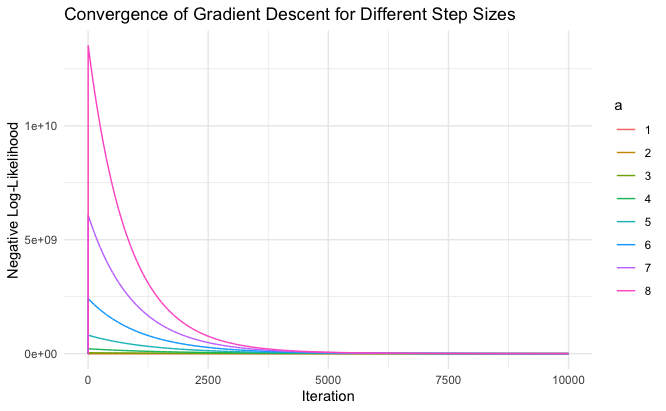

# Homework 1: Logistic Regression via Gradient Descent

This assignment implements gradient descent to minimize the negative log-likelihood of the logistic regression model.

## Function
**`LogisticReg.gd(X, y, alpha)`**  
  Runs gradient descent starting from zero coefficients.  
  Stops when the maximum absolute gradient component is < `1e-6` or after 10,000 iterations.  
  Returns:
   `beta`: estimated coefficients
   `nll_values`: sequence of negative log-likelihood values over iterations

## Experiment
 Data: simulated logistic regression with `n = 100` and `p = 20` predictors  
 Step size:  
  \[
  \alpha = \frac{n \cdot a}{\varphi_{\max}(X^\top X)}, \quad a = 8,7,\dots,1
  \]

## Results
 **Small step sizes** (`a = 1, 2, 3`): slower convergence, more iterations needed  
 **Larger step sizes** (`a = 7, 8`): faster convergence to optimum  
 **Too large step size** (e.g., `a = 20`): divergence / overshooting  

## Plot
The figure below shows the negative log-likelihood as a function of iteration for each step size `a`:

